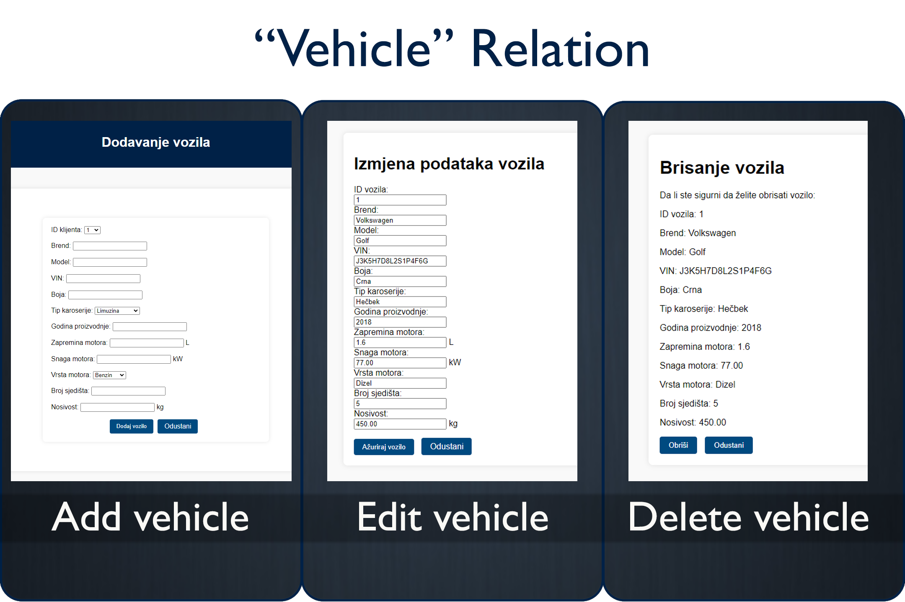
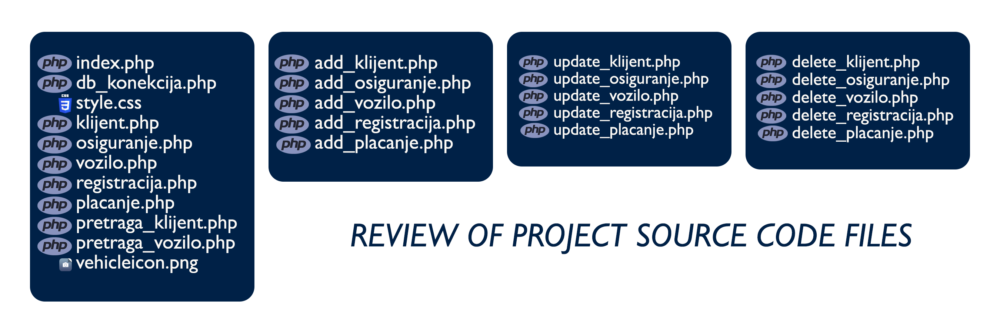
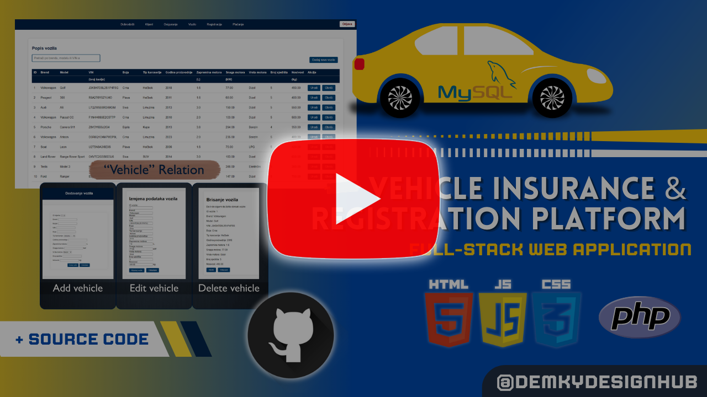

# 🚗 Vehicle Insurance & Registration App

Welcome to the repository for the Vehicle Registration and Management App! 🚗📋 This project provides a comprehensive solution for managing vehicle registrations, client information, and insurance details. Designed as a full-stack application, it covers both frontend and backend functionalities, offering a seamless experience for users and administrators alike.

Technologies used:
- PHP: For server-side scripting and backend logic
- HTML5: For creating the structure of web pages
- CSS: For styling and layout of the application
- JavaScript: For enhancing user interactions and client-side functionalities
- MySQL: For managing and storing data in a relational database
- XAMPP: As the development environment to run Apache and MySQL locally
- Visual Studio Code: As the primary code editor used for development

This application is built to facilitate the management of vehicle registrations and associated data. It supports a range of operations including adding new clients and vehicles, editing existing records, and deleting data. The system ensures data integrity and seamless integration between various components through a well-structured relational database.

| User and admin interfaces | Separate interfaces for users and administrators to manage and interact with the system efficiently |
|:-----|:--------:|
| Relational database | The database is set up to manage information about clients, vehicles, registrations, payments, and insurance. It’s designed to keep data organized and consistent, making it easy to run queries and find the information you need |
| Data management | Capabilities to add, edit, and delete client and vehicle records, ensuring smooth data operations and updates |
| Dynamic search and filtering | Tools to search and filter records based on various criteria, enhancing the usability of the system |

## ▶️ YouTube Overview

## ✉️ Contact

 

## 👍 Feedback

I'm always open to hearing your thoughts! If you have any suggestions, run into any issues, or just want to share some feedback, feel free to get in touch. Your input is greatly appreciated and helps make the project better!
